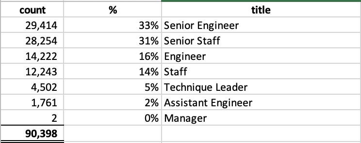

# Pewlett Hackard Analysis

## Purpose 
The purpose of this analysis is to determine the number of retiring employees in the coming years and identify the employees who are eligible to participate in the mentorship program to prepare staff members who are expected to take over.

## Results
Based on our analysis we noted the following:
* In the coming few years, 90,398 people will be retired. To determine the number of retired people we used the birth date range of January 1, 1952, and December 31, 1955.
* Out of 90,398 people, 64% represent senior-level engineers and senior staff as shown below.
* The number of people eligible for mentoring staff members that would be replacing retiring people equal to 1,549 people.  According to the current policy, people that were born in 1965 are eligible for mentorship.
* The total number of employees eligible for mentorship represents less than 2% of the total retiring list.

Breakdown of retiring titles:

 
1.	Summary: Provide high-level responses to the following questions, then provide two additional queries or tables that may provide more insight into the upcoming "silver tsunami."
o	How many roles will need to be filled as the "silver tsunami" begins to make an impact?
o	Are there enough qualified, retirement-ready employees in the departments to mentor the next generation of Pewlett Hackard employees?

## Summary:
* In the near future, the Company expects that around 90 thousand people will need to be filled.
* We believe that the Company does not have enough people available for mentorship based on the current policy that only considers people that were born in 1965.
* Considering the shortage of people available for mentorship, we suggest involving employees for mentorship that were born between 1956 – 1964. Currently, the Company has 166,117 people born in that range that should be sufficient to cover the shortage of eligible mentors.

